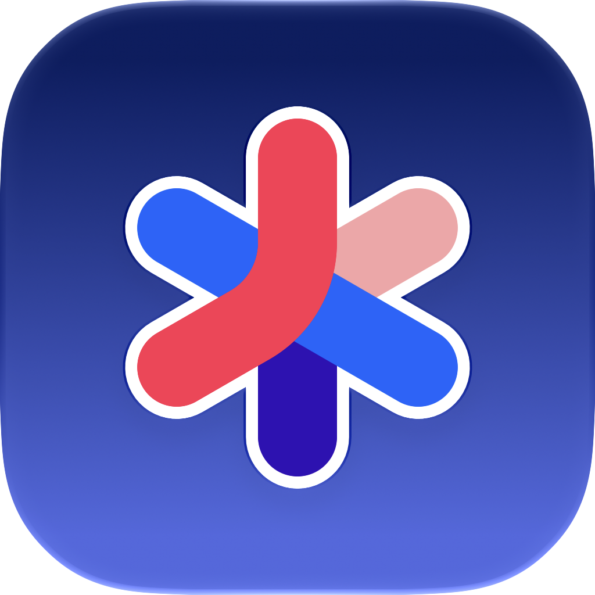
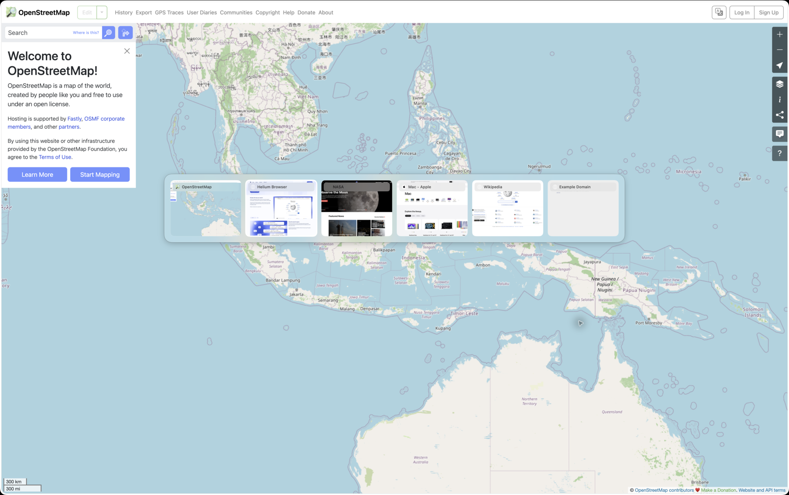
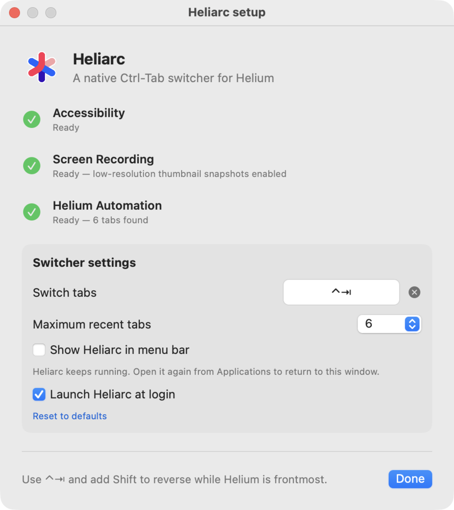

<p align="center">
  
</p>

<h1 align="center">Heliarc</h1>

<p align="center">
  <strong>Arc-style tab switching and tab previews for Helium.</strong><br>
  A super-lightweight, privacy-preserving, open-source macOS add-on that gives Helium the missing touches from Arc Browser — without a browser extension.
</p>

<p align="center">
  <a href="https://github.com/robin-liquidium/heliarc/releases/latest"></a>
  <a href="LICENSE"></a>
  
</p>



Heliarc makes `Ctrl-Tab` in [Helium](https://helium.computer/) work like Arc's recent-tab switcher. Hold the shortcut to see visual previews, keep pressing to move through recent tabs, add Shift to reverse, and release to switch.

It is a native, dockless macOS app with Sparkle automatic updates. There is no Chrome extension, no native-messaging host, no account, and no analytics.

## Why Heliarc?

- **Arc-style Ctrl-Tab:** switch by recency instead of blindly walking the tab strip.
- **Visual tab previews:** lightweight cached thumbnails show the last state you left behind.
- **Favicons and titles:** recognize tabs instantly without opening them first.
- **Built specifically for Helium:** communicates with Helium through its native Apple Events interface.
- **Tiny footprint:** no embedded browser or always-running capture stream.
- **Private by design:** browser data stays local; Heliarc has no telemetry or external service.
- **Feels native:** dockless operation, optional menu-bar icon, configurable shortcut, and launch at login.
- **Keeps itself current:** checks for signed updates automatically, with manual checks in setup and the menu bar.

If you searched for **Arc features in Helium**, **how to arcify Helium**, **Arc Ctrl-Tab for Helium**, or **tab previews in Helium**, this is the missing piece.

## Install

1. Download [`Heliarc.dmg`](https://github.com/robin-liquidium/heliarc/releases/latest/download/Heliarc.dmg).
2. Drag Heliarc into Applications and open it.
3. Allow Accessibility and Helium Automation when macOS asks.
4. Optionally allow Screen Recording for visual tab thumbnails.

That is it. Nothing needs to be installed or configured inside Helium.

**Requirements:** macOS 14 Sonoma or later and [Helium](https://helium.computer/).

## Settings

<p align="center">
  
</p>

You can change or disable the shortcut, show 2–10 recent tabs, hide Heliarc from the menu bar, and launch it automatically at login. Hiding the menu-bar icon does not stop the app; open Heliarc again from Applications to return to settings.

## Updates

Heliarc uses Sparkle to check for signed updates automatically. Updates download and install in the background by default, then apply when Heliarc quits. You can also choose **Check for updates…** in Heliarc setup or the menu bar.

Versions before 1.1.0 did not include Sparkle, so they need one manual install first. After that, future releases can update through the app. The update feed is `https://github.com/robin-liquidium/heliarc/releases/latest/download/appcast.xml` and every update archive and feed is Ed25519-signed.

## Lightweight by design

Heliarc captures a single low-resolution image when you leave a tab. It does not continuously record the screen, and it skips redundant captures during rapid switching.

- Decoded thumbnails use a **4 MB** memory cache.
- Compressed thumbnail storage is limited to **40 files / 8 MB**.
- Favicons use a **768 KB** decoded cache and an **8 MB / 512-icon** persistent disk cache.
- Only two favicon requests run at once, responses are capped at 128 KB, and images are downsampled to 48 px.
- Stale or overlapping screenshot work is rejected instead of accumulating in the background.

The installed app is roughly 8 MB. Sparkle is the only third-party runtime dependency.

## Privacy

Heliarc uses Accessibility for the global shortcut and tab activity notifications, Apple Events to track the active tab and read and activate tabs in the frontmost Helium window, and optional Screen Recording for thumbnails. While Helium is in the foreground, a lightweight periodic check also reconciles the active tab. Recency is tracked while Heliarc is running; extremely rapid switches may skip an intermediate tab.

Favicons are read from Helium's own local favicon database through a validated temporary snapshot, then stored in Heliarc's small persistent cache. The full database snapshot is discarded immediately after each lookup batch. If Helium has no icon, Heliarc falls back to the page's own `/favicon.ico` without browser cookies or stored credentials. Heliarc contains no analytics, advertising, crash-reporting SDK, or cloud backend.

## FAQ

### Can I get Arc's Ctrl-Tab switcher in Helium?

Yes. That is Heliarc's main purpose: recent-tab ordering, visual previews, titles, and favicons in a native Helium overlay.

### Does Heliarc need a Chrome extension?

No. Heliarc works directly with Helium from macOS. There is nothing to install, enable, or reload in the browser.

### How do I enable tab previews in Helium?

Install Heliarc and grant optional Screen Recording permission in its setup window. Without that permission, switching still works with tab titles and favicons.

### Is Heliarc affiliated with Helium or Arc?

No. Heliarc is an independent open-source project. Helium, Arc, and their respective marks belong to their owners.

<!-- release:start -->
### Latest release: 1.1.1

- Starting at login now stays quietly in the background instead of opening the setup window; open Heliarc again from Applications whenever you want settings.
<!-- release:end -->

## Build from source

Heliarc is a Swift Package with no third-party runtime dependencies.

```sh
git clone https://github.com/robin-liquidium/heliarc.git
cd heliarc
swift test
./script/build_and_run.sh
```

The development script builds, signs, installs, and opens `/Applications/Heliarc.app`. Release packaging and notarization are documented in [RELEASING.md](RELEASING.md).

## Credits

Heliarc started as a standalone native evolution of [Tab Switcher](https://github.com/nechemyaspitz/tab-switcher), originally created by Harshay Buradkar and released under the MIT License. Its Ctrl-Tab interaction and visual-switcher foundation made this project possible.

Heliarc is an independent repository rather than a GitHub fork because its Helium-only native architecture no longer contains the original Chrome extension or native-messaging runtime. Attribution and the original copyright notice remain in [LICENSE](LICENSE).

## License

[MIT](LICENSE)
